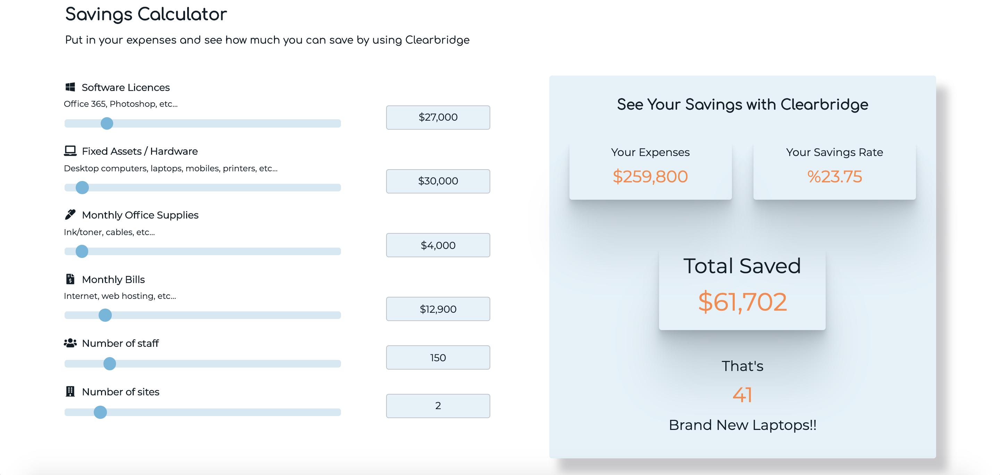

# Savings Calculator

## Description
An interactive calculator tool that website visitors can use
to see how much savings Clearbridge can offer them 
by using Clearbridge to manage their IT and help with their business optimization.
Live page: https://mirimar8.github.io/Savings-Calculator/

## Technologies Used
* HTML5
* CSS3
* JavaScript
* FontAwesome - for implementing icons on the page
* Google fonts and transfonter - @font-face generator
* Live Server Extension with VSCode- to launch a development local server.

